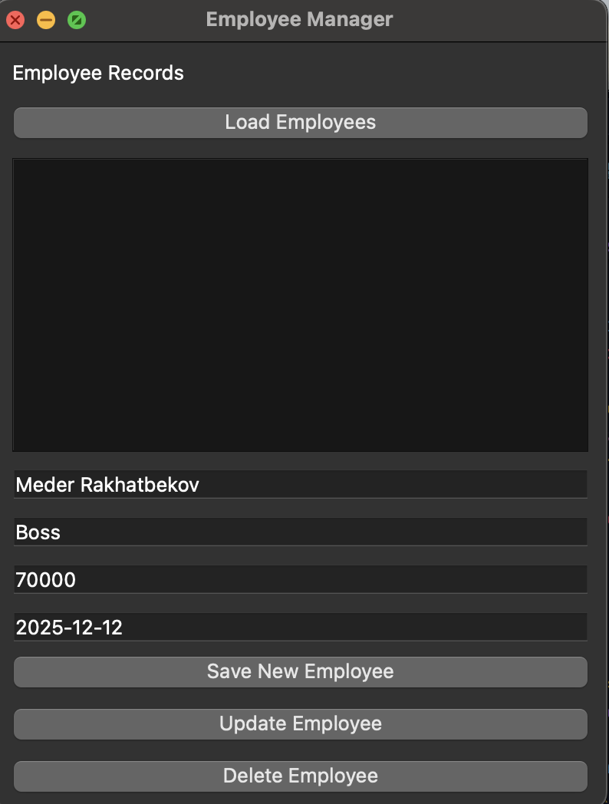
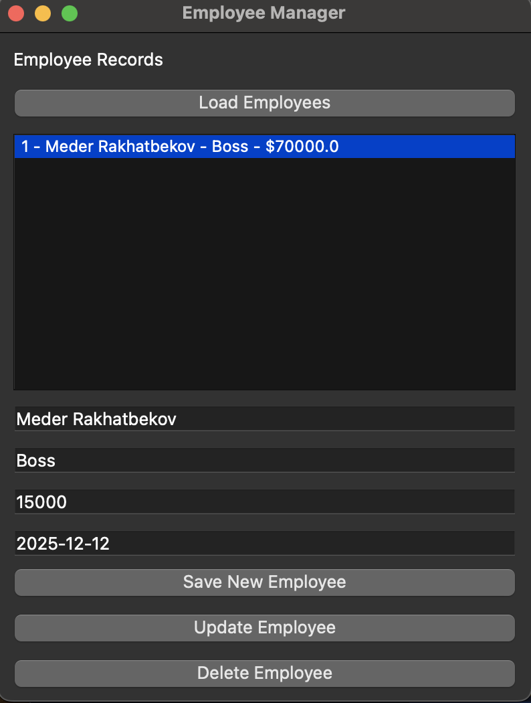
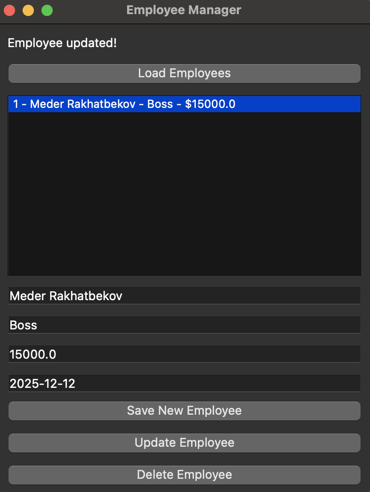
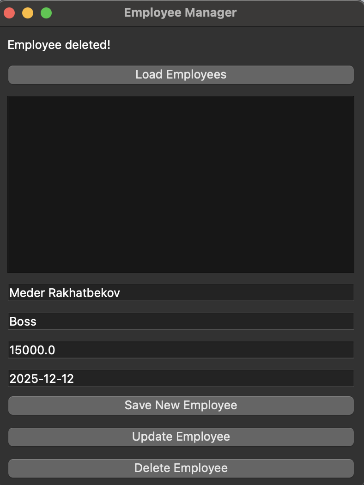

This Python application allows you to manage employee records using a SQLite database. It provides a simple graphical user interface (GUI) built with PyQt6. You can perform CRUD (Create, Read, Update, Delete) operations to manage employee data, such as name, position, salary, and hire date.

## Features
- **Create**: Add new employee records.
- **Read**: View all employees and their details.
- **Update**: Modify existing employee records.
- **Delete**: Remove employees from the database.

## Requirements
- Python 3.6+
- PyQt6
- SQLite3

RUN gui.py to start an application

SCREENSHOTS and FAQ:
1. To add a new employee you need to type all the required data first and press "Save new employee"

2. To update a user you need to select it first and then type in all the data. Once everything is filled, press update employee

3. To remove an employee you need to select one and press "Delete employee"

